# Taller construyendo un mundo 🚀🌎

## Nombre del estudiante
- Camilo Andrés Medina Sánchez
- 🏫 Universidad Nacional De Colombia 🏫
- 💻Ingeniería de sistemas y compuitación💻

## Fecha de entrega
`2026-02-20`

---
## Descripción breve
En el presente taller se prentende comprender los concpetos básicos del renderizado de modelos 3d haciendo uso de varias herramientas de programación, como lo son: 
- Python
- React haciendo uso de vite
- Unity
El taller es de vital importancia al permitir comprender las dinámicas básicas de visualización, concpetos que se usarán más adelante en el curso para el desarrollo de proyectos.

---
## Implementaciones

### Python
La visualización de objetos 3D en python se desarrolla con el IDE jupyterlab. A continuación, se indica el proceso de apertura del entorno de desarrollo y la configuración básica que se desarrolla para el funcionamiento.

```powershell

>pip install jupyterlab

>python -m jupyterlab

```

Con esto, se abre en una ventana del navegador predeterminado el IDE. Para proceder con la visualización del modelo.
Como primer paso, se debe desarrollar la importación de la malla que para el caso particular se encuentra en formato .OBJ en el siguiente enlace se puede ver el código utilizado para la [Importación de .OBJ en python con Trimesh.](#importacion_modelo_trimesh)
Ahora bien, se debe acceder al número de vértices, número de caras y el número de aristas. A continuación, se detalla el código para acceder a estas [propiedades.](#acceso_a_propiedades) Ahora bien, se debe comprender la importancia de esta información, por ello, se debe tener en cuenta la ecuación de Euler para mallas cerradas, la cual sigue el enunciado:
$$V- E + F = 2$$
donde: 
- V es el número de vértices
- E es el número de aristas únicas 
- F es el número de caras

En los datos recolectados se evidencia que en la malla seleccionada existen:

- 24461 vértices
- 48918 caras
- 73377 aristas únicas
Aplicando la formula se obtiene: **$24461 - 73377 + 58918 = 2$**
Lo cual indica que se está trabajando con una malla triangular cerrada sin agujeros, esto es de vital importancia al indicar la consistencia topológica de la estructura, si esta es incorrecta o inapropiada puede darse el caso que algunos algoritmos lleguen a fallar.
Para continuar, se deben resaltar los elementos de la malla, esto con el fin de comprender todos los elementos que la componen, para esto se asignan tres colores diferentes a cada uno de los elementos, siendo estos: 

| **Elemento** | **Color**      |
|--------------|----------------|
| Caras        | Rojo brillante |
| Aristas      | Negro          |
| Vértices     | Cyan           |

Ahora bien, acá se encuentra el [Código](#cambio_color_elementos) para cambiar los colores de la malla y se encuentra la [Visualización final.](#)

### Unity

Como primera medida en unity se debe cear un proyecto desde la interfaz de unity hub.

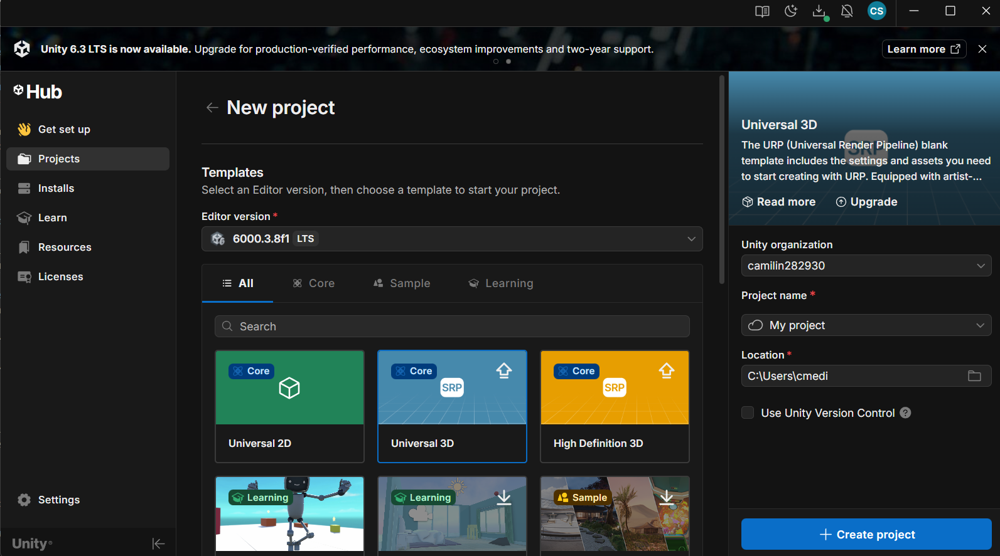

En esta interfaz se seleccionan los datos del proyecto a crear, indicando el directorio y el nombre del proyecto. Despues de una prolongada espera se carga el área de trabajo en donde se puede comenzar a interactuar con los elementosa dispuestos. 

El modelo .OBJ no se púede trabajar directamente desde la carpeta media, este debe estar colocado en la carpeta assets del directorio del proyecto unity. 

Este se debe cargar en la escena, simplemente haciendo un sencillo drag and drop. No obstante, se presentó el problema de que el tamaño del modelo sobreexcedia el tamaño de la escena, por lo cual, se debe indicar un factor de redimensionamiento, como se muestra en la imagen a continuación.

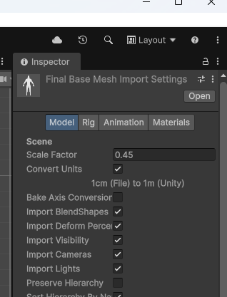

Además, se deben indicar las coordenadas en las que se van a colocar el modelo, como se pretende que esté centrado, se localiza en las coordenadas (0, 0, 0).

Para mejorar la visualización, se hace uso de la inteligencia artificial generativa para desarrollar un script que permita la rotación automática del modelo 3D sobre el eje y, acá se encuentra el [Script](#rotacion).

Uno de los objetivos del taller es que se permita el despliegue de la información de la malla haciendo uso de la consola, para eso se uso el [Script](#info_malla) y los [Resultados son los siguientes](#resultados_unity)

### Three.js / React Three Fiber
Creación del proyecto base con vite y react fiber.

```powershell

> npm create vite@latest

```

Se despliegan las opciones para seleccionar el framework a utilizar, el lenguaje de programación (variante) e indicar el nombre del proyecto

**Datos básicos del proyecto**

- Project name (Nombre del proyecto): visualizacion_modelos_3d

- Framework: React

- Variant: Javascript

- Vite 8 beta: No

De forma automática, se desarrolla la instalación de paquetes y librerias, si se desarrolla de forma manual, se utiliza el comando

```powershell

> npm install

```

Para proceder, se debe asegurar que existen las dependencias que permiten el desarrollo de la visualización tridimensional, para esto se desarrolla la instalación de las librerías con el comando:

```powershell

> npm i three @react-three/fiber @types/three @react-three/drei

```
Cuando el proyecto ya está configurado, se puede proceder a ejecutar el servidor de desarrollo para visualizar los cambios que se han desarrollado, se muestra el comando necesario para la inicialización del servidor.
```powershell

> npm run dev

```

Ahora bien, en términos de desarrollo se pretende generar una interfaz sencilla que permita seleccionar con botones la visualización.
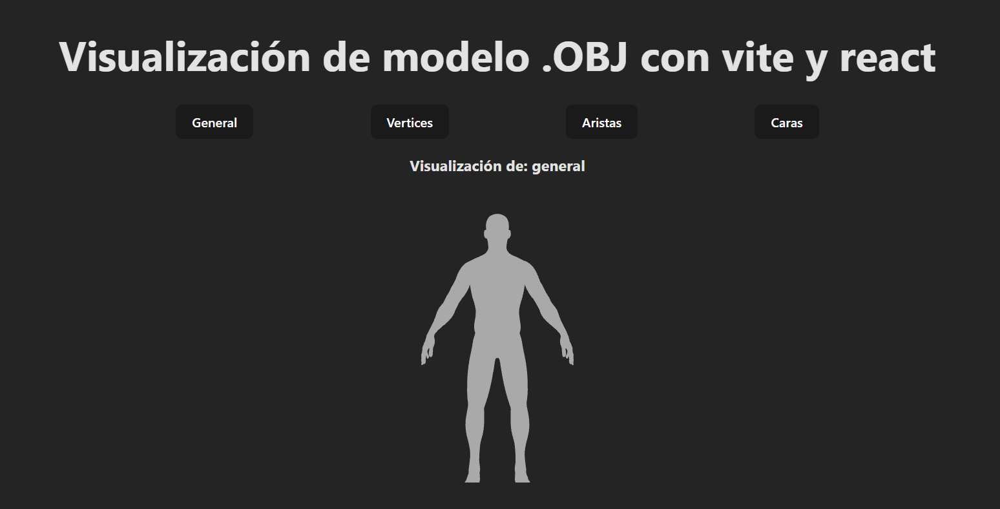
Como se puede evidenciar en la imagen, existen cuatro botones que permiten seleccionar la visualización que el usuario desee, las visualizaciones disponibles son:

- General
- Vertices
- Aristas
- Caras

El código que se usó para variar las visualizaciones se encuentra [aqui](#general_three).
Como se logra evidenciar en la implementación, existen dos definiciones fundamentales modo y setModo. Además, existe la función cambiarModo, cada uno de los botones maneja un evento onclick (Recordando que javascript es un lenguaje orientado a eventos con el fin de ejecutar acciones) que llama a la función cambiarModo, al hacer esto se selecciona el modo de visualización con el fin de alternar entre una vista y la otra.

Dentro del canvas, se indica la visualización que se tiene haciendo un condicional con el modo definido. 
```javascript
{modo === "general" && <ModelGeneral />}
{modo === "vertices" && <ModelVertices />}
{modo === "aristas" && <ModelAristas />}
{modo === "caras" && <ModelCaras />}
```
Con esto se garantiza que la visualización se alterna según el botón presionado.
Además, se generan archivos particulares para cada una de las visualizaciones, es posible desarrollarlo usando mejores practicas de programación y la reutilización de código. No obstante, para esta practica inicial se decidió desarrollarlo de esta manera con el fin de comprender los conceptos de una manera más apropiada. Es por ello que, hay cuatro archivos de visualización de modelos.

---  

## Resultados visuales
A continuación, se muestran los resultados de la práctica en cada uno de los lenguajes y herramientas utilizadas para la visualización

### Python - Implementación
Primera visualización de una malla en formato .obj haciendo uso de python con trimesh

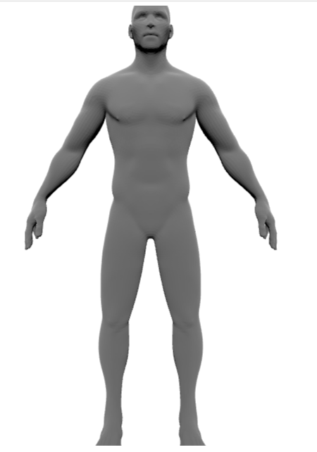

Visualización general del objeto 3d que se genera por el objeto .OBJ

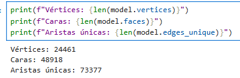

Información de los elementos de la malla desplegados en una celda de código de un cuaderno de Jupyter.

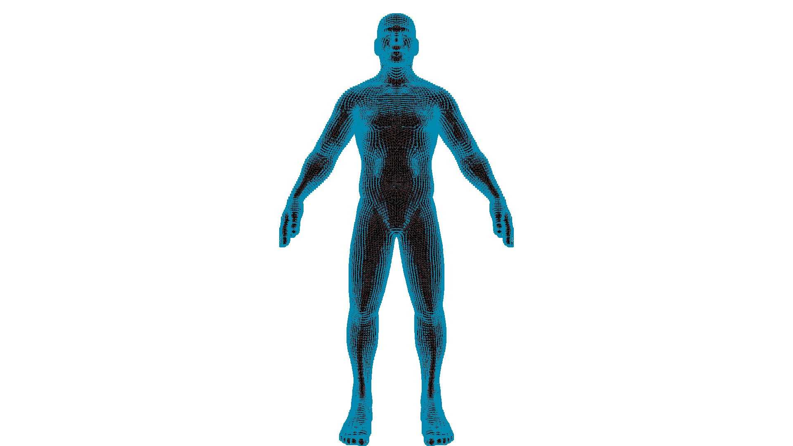

Renderización final de la malla al resaltar los elementos que la componen con diferentres colores.


### Unity - Implementación

<a id="resultados_unity"></a>
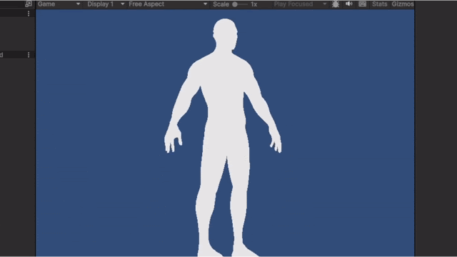

Visualización del modelo .OBJ al ser cargado en la escena de unity.

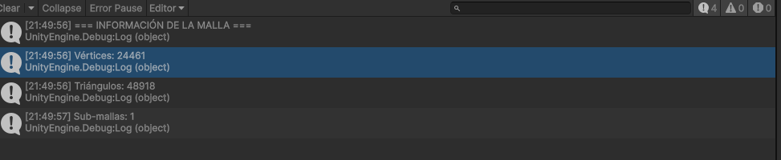

Visualización de la información de la malla haciendo uso de unity.

### Three.js - Implementación

<a id="resultados_three"></a>


Visualización general de la malla formato .OBJ desde la interfaz de threejs con vite y react.

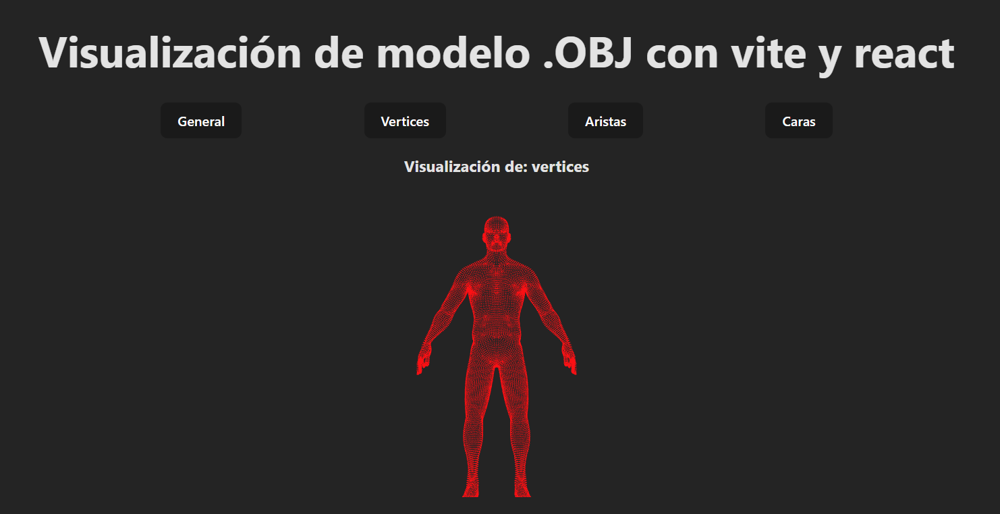
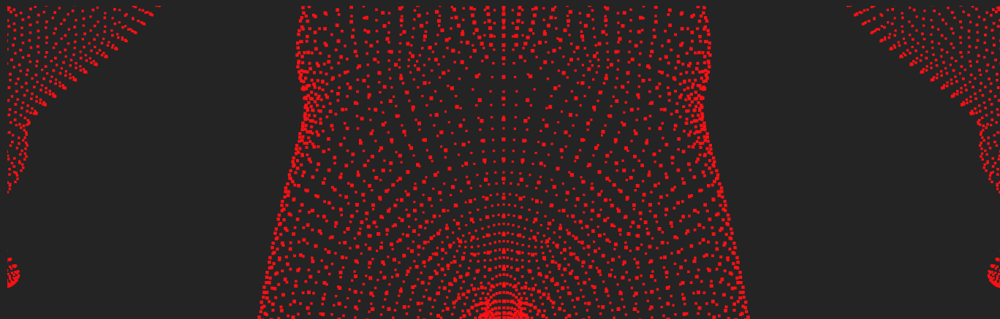

Visualización general y enfocada de los vértices resaltados en color rojo.

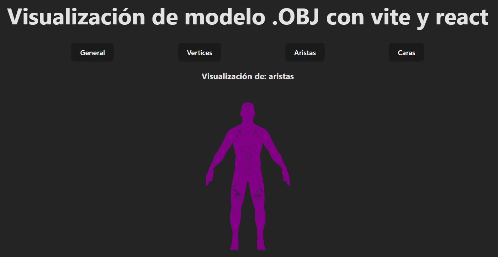
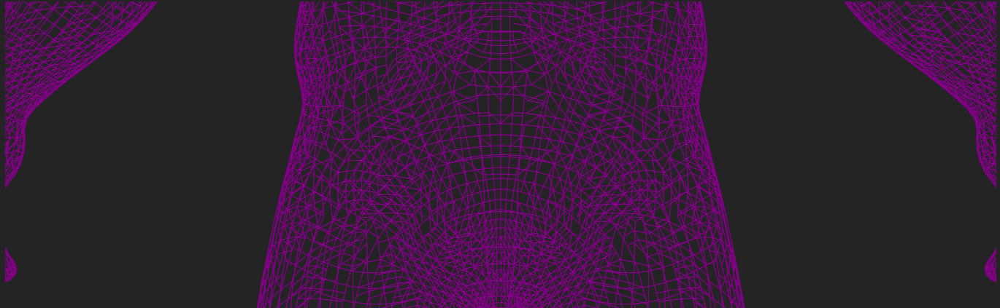

Visualización general y enfocada de las aristas resaltados en color morado.

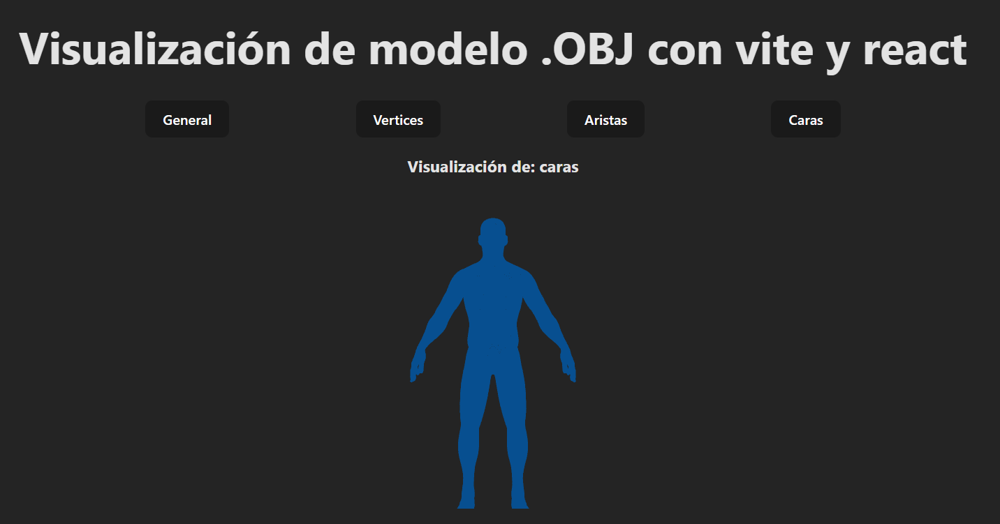
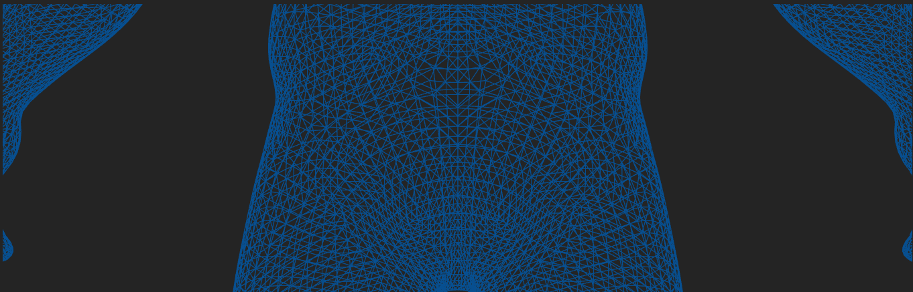

Visualización general y enfocada de las caras resaltados en color azul.

---

## Código relevante

En la presente sección se pueden ver los snippets o secciones de código que se han utilizado con el fin de cumplir el propósito del presente taller.

### Ejemplo de código Python:
<a id="importacion_modelo_trimesh"></a>
Importación y visualización con trimesh sencilla de una malla en formato .obj
```python
import trimesh
model = trimesh.load_mesh(r'../media/FinalBaseMesh.obj')
model.show()
```
<a id="acceso_a_propiedades"></a>
Obtención del número de vértices, aristas y caras de un modelo con Trimesh.
```python  
print(f"Vértices: {len(model.vertices)}")
print(f"Caras: {len(model.faces)}")
print(f"Aristas únicas: {len(model.edges_unique)}")
```
<a id="cambio_color_elementos"></a>
Cambio del color de los elementos de la malla con el fin de resaltar cada componente.
```python  
color_caras = [220, 20, 60, 255]
color_aristas = [0, 0, 0, 255]
color_vertices = [0, 200, 255, 255]

model.visual.face_colors = np.tile(
    color_caras,
    (len(model.faces), 1)
)

edges = model.edges_unique
edge_path = trimesh.load_path(model.vertices[edges])

edge_colors = np.tile(
    color_aristas,
    (len(edge_path.entities), 1)
)

edge_path.colors = edge_colors

points = trimesh.points.PointCloud(
    model.vertices,
    colors=color_vertices
)

scene = trimesh.Scene()
scene.add_geometry(model)
scene.add_geometry(edge_path)
scene.add_geometry(points)

scene.show(flags={'lighting': False})
```
### Ejemplo de código Unity (C#):

<a id="rotacion"></a>
Rotación de la malla sobre el eje y de forma automática
```csharp
using UnityEngine;

public class AutoRotate : MonoBehaviour
{
    public Vector3 eje = Vector3.up;
    public float speed = 50f;

    void Update()
    {
        transform.Rotate(0f, 50f * Time.deltaTime, 0f);
    }
}

```

<a id="info_malla"></a>
Visualización de la información de la malla a través de la consola.

```csharp
using UnityEngine;

[RequireComponent(typeof(MeshFilter))]
public class MeshInfo : MonoBehaviour
{
    void Start()
    {
        Mesh mesh = GetComponent<MeshFilter>().sharedMesh;

        if (mesh == null)
        {
            Debug.LogError("No se encontró Mesh.");
            return;
        }

        Debug.Log("=== INFORMACIÓN DE LA MALLA ===");
        Debug.Log("Vértices: " + mesh.vertexCount);
        Debug.Log("Triángulos: " + mesh.triangles.Length / 3);
        Debug.Log("Sub-mallas: " + mesh.subMeshCount);
    }
}
```

  

### Ejemplo de código Three.js:
<a id="general_three"></a>
Código de la pantalla principal del proyecto con el fin de alternar las visualizaciones según el boton indicado.

```javascript
import { useState } from 'react'
import './App.css'
import { Canvas } from "@react-three/fiber"
import { OrbitControls } from "@react-three/drei"
import ModelGeneral from "./model_general"
import ModelVertices from './model_vertex'
import ModelCaras from './model_caras'
import ModelAristas from './model_aristas'

function App() {
	const [modo, setModo] = useState("general")

	const cambiarModo = (visualizacion) => {
		setModo(visualizacion)
	}

	return (
		<>
			<div className="general-container-mini">
				<h1>Visualización de modelo .OBJ con vite y react</h1>

				<div className="opciones">
					<button onClick={() => cambiarModo("general")}>General</button>
					<button onClick={() => cambiarModo("vertices")}>Vertices</button>
					<button onClick={() => cambiarModo("aristas")}>Aristas</button>
					<button onClick={() => cambiarModo("caras")}>Caras</button>
				</div>

				<h3>Visualización de: {modo}</h3>

			</div>

			<div className="general-container">

				<Canvas camera={{
					position: [0, 0, 40],  // aleja la cámara
					fov: 30,
					near: 0.1,
					far: 1000
				}}>
					<ambientLight intensity={1} />
					<directionalLight position={[0, 0, 0]} />
						{modo === "general" && <ModelGeneral />}
						{modo === "vertices" && <ModelVertices />}
						{modo === "aristas" && <ModelAristas />}
						{modo === "caras" && <ModelCaras />}
					<OrbitControls />
				</Canvas>
			</div>
		</>
	)
}

export default App
```
<a id="modelo_three"></a>
Código que se incrusta en un canvas con el fin de visualizar un modelo .OBJ.

```javascript
import { useLoader } from "@react-three/fiber"
import { OBJLoader } from "three/examples/jsm/loaders/OBJLoader"
import modelo from "@media/FinalBaseMesh.obj"

export default function ModelGeneral() {

  const obj = useLoader(OBJLoader, modelo)

  return (
    <group position={[0, -11, 0]} scale={[1, 1, 1]}>
      <primitive object={obj} />
    </group>
  )
}

```


---
## Prompts utilizados
Lista de los prompts utilizados con herramientas de IA generativa durante el desarrollo del taller.
  

```

"Tengo una visualización de una malla 3d con python haciendo uso de la librería trimesh. El cargado del archivo se hace con trimesh.load_mesh(), hago lectura del numero de vertices haciendo uso de la función reservada del lenguaje len() y accediendo a la propiedad/atributo .vertices del modelo cargado. Haciendo uso de .visual.vertex_colors, cambio los colores de los vertices al definido en una lista con valores RGB. Ahora bien, necesito cambiar el color de aristas y caras ¿Cómo lo hago?"

"Dame un script de C# para unity con el fin de rotar un objeto en formato .OBJ sobre el eje y. También, dime como lo implemento para que ejecute su funcionalidad."

```  

---
## Aprendizajes y dificultades

Reflexión personal sobre el proceso de desarrollo del taller en 2-3 párrafos.


### Aprendizajes

¿Qué aprendiste o reforzaste con este taller? ¿Qué conceptos técnicos quedaron más claros?  

### Dificultades

¿Qué parte fue más compleja o desafiante? ¿Cómo lo resolviste?  

### Mejoras futuras

¿Qué mejorarías o qué aplicarías en futuros proyectos?

---

  

  

## Contribuciones grupales (si aplica)

Taller realizado de forma individual.

---
## Estructura del proyecto

```
semana_01_1_construyendo_mundo_3d/
├── python/
├── unity/
├── threejs/
├── media/
└── README.md
```

---
## Referencias
- Build website with threejs and react: https://medium.com/@wuzsamie/build-website-with-three-js-and-react-three-fiber-488c73e982dd

- What is react three drei: https://medium.com/@sekharsmemories/what-is-react-three-drei-bba258773053

- Loading models react three fiber.docs: https://r3f.docs.pmnd.rs/tutorials/loading-models
  

---
## Checklist de entrega

- [x] Carpeta con nombre `semana_01_1_construyendo_mundo_3d`
- [ ] Código limpio y funcional en carpetas por entorno
- [x] GIFs/imágenes incluidos con nombres descriptivos en carpeta `media/`
- [ ] README completo con todas las secciones requeridas
- [ ] Mínimo 2 capturas/GIFs por implementación
- [x] Commits descriptivos en inglés
- [x] Repositorio organizado y público

---