# Taller Conversion Formatos 3D ✨👩‍🎤

## Nombre del estudiante
- Camilo Andrés Medina Sánchez
- 🏫 Universidad Nacional De Colombia 🏫
- 💻Ingeniería de sistemas y compuitación💻

## Fecha de entrega
`2026-02-21`

---
## Descripción breve

En el presente taller se pretende comprender las utilidades y diferencias que hay entre cada uno de los formatos que se pueden utilizar para los modelos 3D.
Además, desde las librerias que ofrece python se permiten comprender las funcionalidades que hay para cambiar el tipo de formato de archivo haciendo 
uso de trimesh.exchange, permitiendo comparar cada una de las características particulares de cada formato.

---
## Implementaciones

En la presente sección se pretende comprender como ha sido el desarrollo de cada una de las implementaciones con una descripción concisa y completa de cada uno de los procesos empleados.

### Python

Para comenzar con la implementación en python, la primer tarea que se desarrolla es el cargado de diferentes archivos en los formatos:
- .obj
- .stl
- .gltf

este proceso es bastante sencilo y se detalló el proceso de su elaboración en la primera entrega de la misma semana, recordando, este proceso se hace haciendo uso del método .load() de trimesh, al especificar como argumento a la función una cadena de caracteres que contiene la ruta al modelo 3D que se pretende cargar.

Una particularidad, al trabajar con modelos en formato .gltf es que es posible que de forma predeterminada la libria lo cargue como una instancia de la clase trimes.Scene, lo cual podria limitar las funcionalidades al ser un objeto de una clase diferente. Por lo anterior se debe [Convertir de un trimesh.Scene a un model.](#conversion-trimesh-scene)

Como se van a desarrollar diferentes análisis sobre los modelos que se transforman en diferentes extensiones de archivo, se genera un marco de trabajo de reutilización de código, basado en las buenas prácticas del desarrollo de software general. Se crea una función denominada [mesh_stats](#mesh-stats) la cual permite el análisis de los elementos de un modelo que es pasado a la función como argumento, esta función retorna una lista que indica:
- Número de vértices del modelo.
- Número de caras en el modelo.
- Número de aristas únicas en el modelo.
- Tiene vertices normales (Bool)
- Tiene normales a las caras (Bool)
- Tiene vertices duplicados (Bool)

Además, se genera una función que reciba como parámetros varias estadísticas de los modelos y permita visualizar las estadísticas en un formato de tabla organizado.
Esta función es bautizada con el nombre [table_creation](#table-creation)

De forma general, se pretende visualizar los modelos seleccionados en cada uno de los formatos y obtener una tabla original de cada uno de los elementos del modelo para después contrastarlos y obtener conclusiones.

Se desarrolla el cargado de los modelos 3D obtenidos en línea, los cuales se pueden visualizar [acá](#cargado-modelos). Además, se genera la [tabla](#visualizacion-tabla) que permite ver los elementos de cada uno de los modelos.
Como se interpreta en estos resultados, el único modelo con vérticas duplicados es el gltf, el modelo con el mayor número de vertices, caras y aristas es el stl y todos tienen normales en vertices y caras.

Ahora bien, se debe proceder a desarrollar la conversión de un formato de archivo a otro, para este proceso, se plantea comenzar con el fotmato .obj y convertirlo a .stl y .gltf. Una de las precisiones más importantes que se debe desarrollar acá es que el modelo 3d en .gltf es un modelo compuesto de almenos dos archivos, en la siguiente captura se evidencia una contingencia que surgió trabajando con estos modelos. 

En el error que se muestra, se ve que se intenta abrir un modelo .gltf sin su correspondiente .bin, lo cual resulta en un error de apertura del archivo.
Cuando se usa trimesh.exchange.gltf.export_gltf, se genera un diccionario que contiene al menos un archivo .bin y un modelo .gltf, los archivos gltf se nombran de forma secuencial, de la siguiente manera.
$$ gltf\_buffer\_0.bin, ... , gltf\_buffer\_n.bin  $$
El número de bin generados depende del modelo en particular. En la siguiente imagen se evidencia esta generación prolongada de bin y un solo .gltf
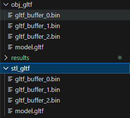
Con lo anterior en mente, se puede escribir el código necesario para la generacióin de nuevos formatos. A continuación se referencia cada uno de los fragmentos de código que permiten generar las nuevas visualizaciones al cambiar el formato, las evidencias de visualización con .show() y las tablas comparativas, para proceder al desarrollo de conclusiones

##### Conversión de .obj a .stl y .gltf
 - [Código](#conversion-origin-obj)
 - [Resultados visuales](#resultados-visuales-origen-obj)

##### Conversión de .stl a .obj y .gltf
 - [Código](#conversion-origin-stl)
 - [Resultados visuales](#resultados-visuales-origen-stl)

##### Conversión de .gltf a .obj y .stl
 - [Código]()
 - [Resultados visuales]()


### Three js
En esta sección se desarrolla la creación de un proyecto en react con vite, threejs y javascript de modo que se permite la visualización de los tres modelos con los que se trabajaron en python en todos los formatos de archivo posibles, esta sección se construye después de la practica en python para tener la facilidad de poseer todos los archivos en todos los posibles formatos.

---  

## Resultados visuales
A continuación, se muestran los resultados de la práctica en cada uno de los lenguajes y herramientas utilizadas para la visualización

### Python - Implementación
<a id="cargado-modelos"></a>
Visualización del archivo .obj seleccionado, sin desarrollar conversiones, solo el cargado del modelo.

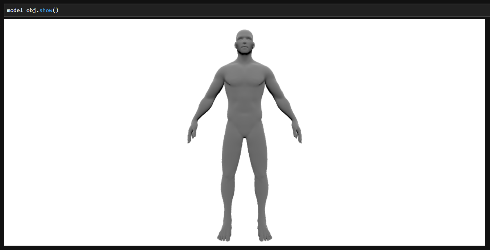
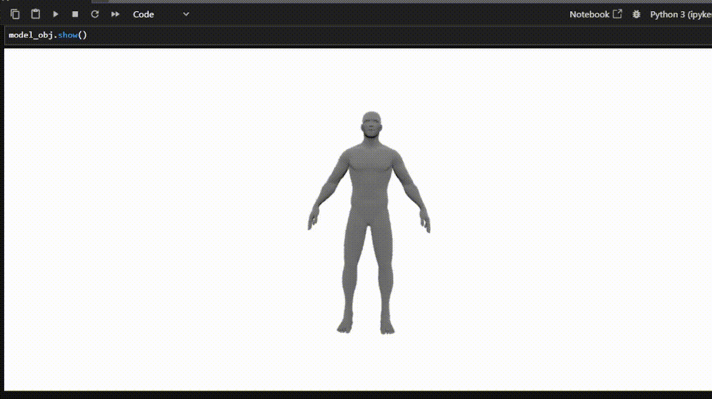


Visualización del archivo .stl seleccionado, sin desarrollar conversiones, solo el cargado del modelo.

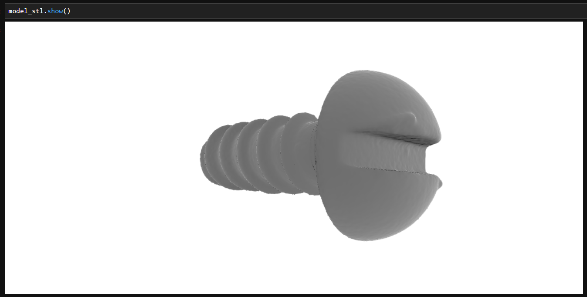
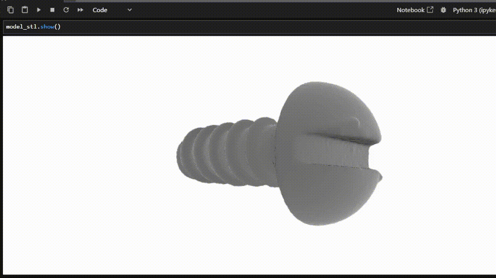


Visualización del archivo .gltf seleccionado, sin desarrollar conversiones, solo el cargado del modelo.

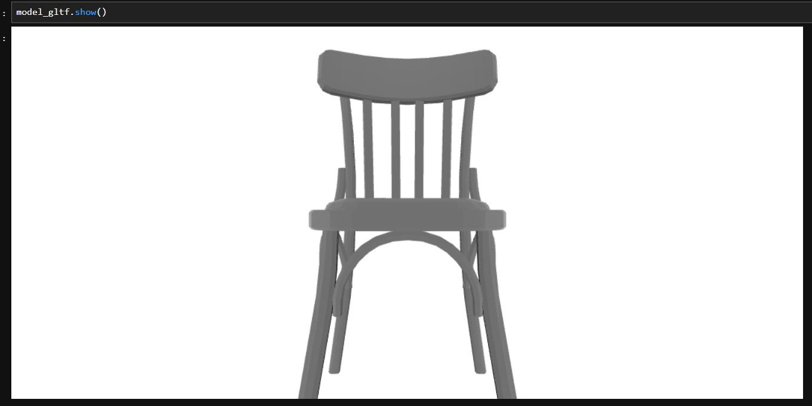
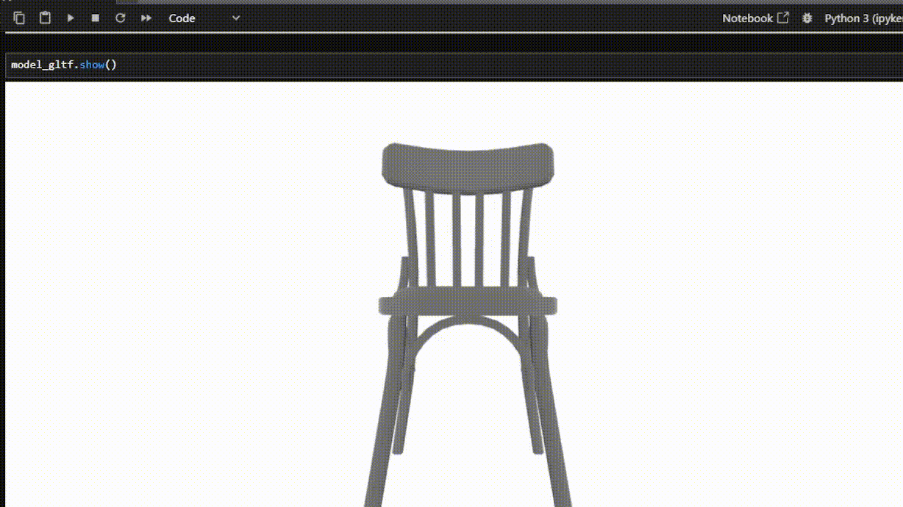

<a id="visualizacion-tabla"></a>

Tabla de las características de cada uno de los modelos cargados.
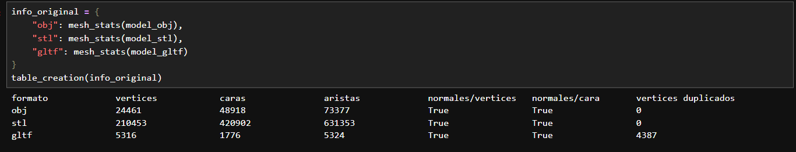

<a id="resultados-visuales-origen-obj"></a>

Origen de obj a gltf en .png y .gif
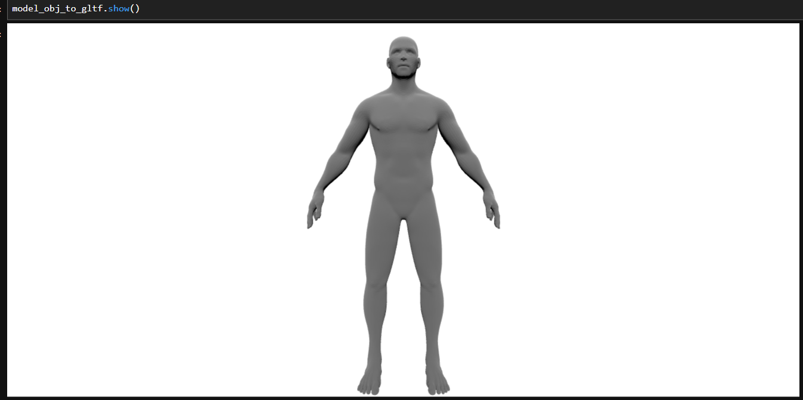


Origen de obj a stl en .png y .gif
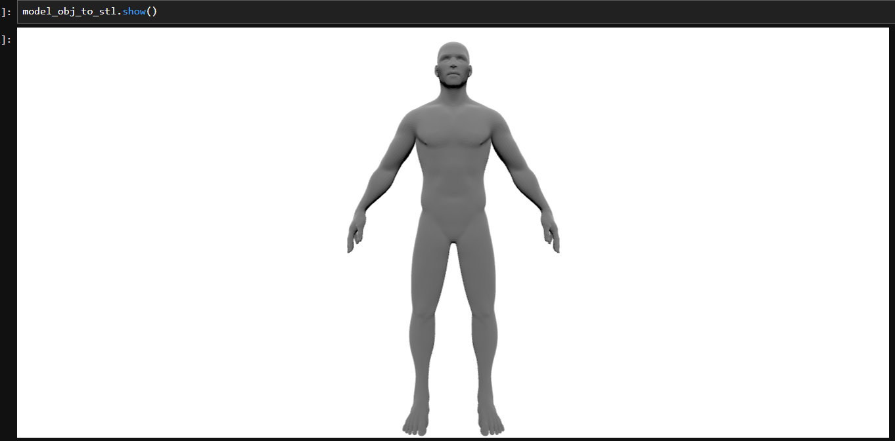
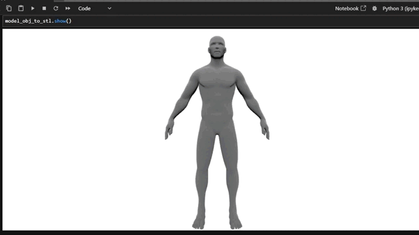

Tabla de resultados con orign desde .obj a .stl y .gltf
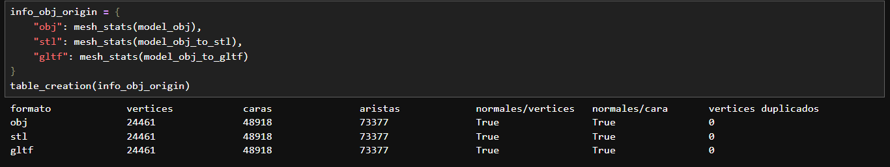

<a id="resultados-visuales-origen-stl"></a>

Origen de .stl a .gltf en .png y .gif
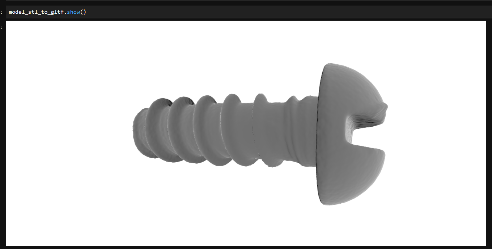
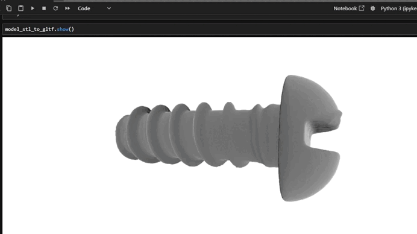

Origen de .stl a .obj en .png y .gif
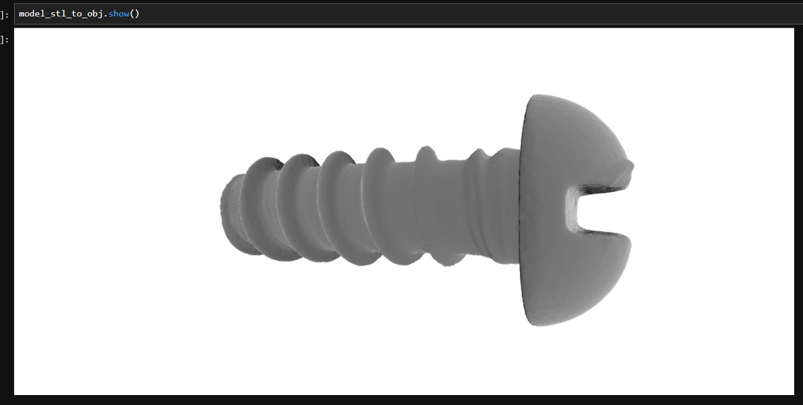
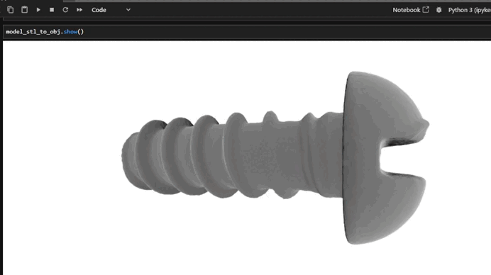

Tabla de resultados con orign desde .obj a .stl y .gltf
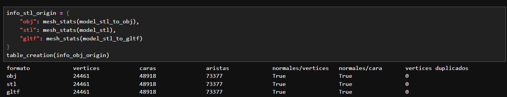


### Three.js - Implementación

---

## Código relevante

En la presente sección se pueden ver los snippets o secciones de código que se han utilizado con el fin de cumplir el propósito del presente taller.

### Ejemplo de código Python:

<a id="conversion-trimesh-scene"></a>
Conversión de una instancia de clase trimesh.Scene a un modelo 3D tradicional.
```python
if isinstance(model_gltf, trimesh.Scene):
    model_gltf = trimesh.util.concatenate(
        tuple(model_gltf.geometry.values())
    )

``` 

<a id="mesh-stats"></a>
Obtención de la información de los modelos en formato de lista.
```python
def mesh_stats(mesh):
    # Normales
    has_vertex_normals = mesh.vertex_normals is not None
    has_face_normals = mesh.face_normals is not None

    # Duplicados
    unique_vertices = np.unique(mesh.vertices, axis=0)
    duplicated_vertices = len(mesh.vertices) - len(unique_vertices)

    return [
        len(mesh.vertices),
        len(mesh.faces),
        len(mesh.edges_unique),
        has_vertex_normals,
        has_face_normals,
        duplicated_vertices
    ]

``` 

<a id="table-creation"></a>
Creación de una tabla con la información de cada uno de los modelos.
```python
def table_creation(info: dict):
    headers = ["formato", "vertices", "caras", "aristas", "normales/vertices", "normales/cara", "vertices duplicados"]
    for col in headers:
        print(col.ljust(20), end="")
    print()
    for formato in info:
        print(formato.ljust(20), end = "")
        for inf in info[formato]:
            print(str(inf).ljust(20), end = "")
        print()
``` 

<a id="conversion-origin-obj"></a>
Conversión de .obj a .stl y .gltf haciendo uso de trimesh.
```python
# Exportaciones
modelo_obj_a_stl_data = stl.export_stl(model_obj)

output_dir = r"../media/obj_gltf"
os.makedirs(output_dir, exist_ok=True)
modelo_obj_a_gltf_data = gltf.export_gltf(model_obj)

# STL
with open(r"../media/model_from_obj_to_stl.stl", "wb") as f:
    f.write(modelo_obj_a_stl_data)

# GLTF
for filename, data in modelo_obj_a_gltf_data.items():
    with open(os.path.join(output_dir, filename), "wb") as f:
        f.write(data)
```

<a id="conversion-origin-stl"></a>
Conversión de .stl a .obj y .gltf haciendo uso de trimesh.
```python
# Exportaciones
modelo_stl_a_obj_data = obj.export_obj(model_stl)

output_dir = r"../media/stl_gltf"
os.makedirs(output_dir, exist_ok=True)
modelo_obj_a_gltf_data = gltf.export_gltf(model_stl)

# OBJ
with open(r"../media/model_from_stl_to_obj.obj", "w", encoding="utf-8") as f:
    f.write(modelo_stl_a_obj_data)

# GLTF
for filename, data in modelo_obj_a_gltf_data.items():
    with open(os.path.join(output_dir, filename), "wb") as f:
        f.write(data)

```


### Ejemplo de código three js (JavaScript):

---
## Prompts utilizados
Lista de los prompts utilizados con herramientas de IA generativa durante el desarrollo del taller.
  

```

```  
---
## Aprendizajes y dificultades

Reflexión personal sobre el proceso de desarrollo del taller en 2-3 párrafos.


### Aprendizajes

¿Qué aprendiste o reforzaste con este taller? ¿Qué conceptos técnicos quedaron más claros?  

### Dificultades

¿Qué parte fue más compleja o desafiante? ¿Cómo lo resolviste?  

### Mejoras futuras

¿Qué mejorarías o qué aplicarías en futuros proyectos?

---

  

  

## Contribuciones grupales (si aplica)

Taller realizado de forma individual.

---
## Estructura del proyecto

```
semana_01_1_construyendo_mundo_3d/
├── python/
├── threejs/
├── media/
├── README.md
└── .gitignore
```

---
## Referencias
- https://medium.com/@qemhal.h/different-ways-to-display-a-table-in-python-d867aefb624a
- https://trimesh.org/trimesh.exchange.html
- https://trimesh.org/trimesh.exchange.obj.html
- https://py5coding.org/integrations/trimesh.html

---
## Checklist de entrega

- [x] Carpeta con nombre `semana_01_2_conversion_formatos_3d`
- [x] Código limpio y funcional en carpetas por entorno
- [x] GIFs/imágenes incluidos con nombres descriptivos en carpeta `media/`
- [x] README completo con todas las secciones requeridas
- [x] Mínimo 2 capturas/GIFs por implementación
- [x] Commits descriptivos en inglés
- [x] Repositorio organizado y público

---