# Taller Espacios Proyectivos Matrices Proyeccion ✨👩‍🎤

## Nombre del estudiante
- Camilo Andrés Medina Sánchez 
- Manuel Santiago Mori Ardila
- Cristian Steven Motta Ojeda
- Brayan Alejandro, Muñoz Pérez 
- Carlos Arturo Murcia Andrade
- Maicol Sebastián Olarte Ramírez

- 🏫 Universidad Nacional De Colombia 🏫
- 💻Ingeniería de sistemas y compuitación💻

## Fecha de entrega
`2026-02-27`

---
## Descripción breve

El presente latter tiene como objetivo comprender las diferencias entre los espacios de proyección ortogonal y de perspectiva, a su vez se pretende comprender las incidencias en el uso de matrices de transformación sobre un objeto o modelo en tercera dimensión.

---
## Implementaciones

### Python
Para la implementación en python se hacen uso de las librerias: 
- numpy
- matplotlib

#### Idea general de las matrices de transformación

De forma original, se representan los puntos como una tupla o lista de la siguiente manera 
$$ (x,y,z) $$
Se pretende la aplicación de una matriz de tranformación para que el punto sea normalizado al dividir por un valor $w'$. De modo que pase a ser 
$$ (\frac{x}{w'},\frac{y}{w'},\frac{z}{w'}) $$

#### Transformación haciendo uso de la matriz de proyección ortográfica sobre el plano xy

Se deben multiplicar todos los puntos con esta matriz con el fin de eliminar la coordenada z, de esta forma, tendremos una proyección del modelo 3d en el plano xy.
Como no existe coordenada z, al momento de visualizarla el modelo 3d en unity, threejs o python no se debe distinguir la profundidad.

\[
\begin{bmatrix}
    1 & 0 & 0 & 0   \\
    0 & 1 & 0 & 0   \\
    0 & 0 & 0 & 0   \\
    0 & 0 & 0 & 1   \\
\end{bmatrix}\begin{bmatrix}
    x  \\
    y  \\
    z  \\
    1  \\
\end{bmatrix} = \begin{bmatrix}
    x   \\
    y  \\
    0   \\
    1   \\
\end{bmatrix}
\]

#### Transformación haciendo uso de la matriz de perspectiva

Se deben multiplicar todos los puntos con esta matriz con el fin de eliminar la coordenada z, de esta forma, tendremos una proyección del modelo 3d en el plano xy.
Como no existe coordenada z, al momento de visualizarla el modelo 3d en unity, threejs o python no se debe distinguir la profundidad.

\[
\begin{bmatrix}
    1 & 0 & 0 & 0   \\
    0 & 1 & 0 & 0   \\
    0 & 0 & 1 & 0   \\
    0 & 0 & 1/d & 0   \\
\end{bmatrix}\begin{bmatrix}
    x  \\
    y  \\
    z  \\
    1  \\
\end{bmatrix} = \begin{bmatrix}
    x   \\
    y  \\
    z   \\
    z/d   \\
\end{bmatrix}
\]
De este modo $w' = z/d$. No obstante, no es posible una proyección en un espacio de cuatro dimensiones, por lo que se debe desarrollar la normalización dividiendo por $w'$:

$$x'' = \frac{x}{z/d} = \frac{dx}{z}$$
$$y'' = \frac{dy}{z}$$
$$z'' = \frac{dz}{z} = z$$

De modo que las coordenadas del punto quedan asi:
$$(\frac{dx}{z}, \frac{dy}{z}, d)$$

Como se puede ver en la nueva expresión de las coordenadas, las proyecciones de un objeto 3d que han sido pasado por una transformación de perspectiva dependen del valor de d (distancia focal) y que esto tendra un efecto muy directo sobre la coordenada z.
Esto permite que se genere un efecto de profundidad.
Los resultados de las diferentes matrices que son acordes a lo descrito a continuación se encuentran [aquí](#Visualización-genera)

### Three js

La implemenbtación en three js, que es bastante sencilla, busca la creación de tres objetos sencillos, los cuales son.
- Esfera
- Cubo
- Pirámide con base circular
Desde la interfaz hay un botón sencillo que permite alternar entre cada uno de los modos de las cámaras. 
A continuación se [referencia el código que permitió esto](#implementacion-threejs).
Esta implementaciónse apoya de Orbit Controls que permite alternar entre los tipos de camaras.
A continuación se [referencias los resultados de visualizacion](#Visualización-perspectiva-horizonte)

En estos se puede ver como en la visualización con cámara en modo de perspectiva se permiten identyificar profundidades, mientras que en la ortogonal, se tiene una proyección en donde los objetos son del mismo tamaño y no es fácil determinar profundidades.

### Unity
Desde la implementación en únity se plantea la [creación de cinco cubos](#creacion-cubos) alineados en el eje z con el fin de diferenciar las visualización con una cámara en modo perspective y una en modo orthographic.
Como primera medidad se varia el valor de FOV, [Las siguientes imagenes reflejan los resultados.](#Visualización-FOV).
Como se identifica en las imagenes, a medida que aumenta el FOV los objetos tienden a distanciarse. Además se visualizan los cinco cubos en cámara [ortogonal](#Visualización-camara-orto-unity) en la cual se identifica que los objetos tienden a estar en segunda dimensión, al ser proyectados sobre un plano XY, como ya se menciona en la sección superior.


### Processing
La practica en processing fue muy similar al desarrollo que se hizo en threejs y en unity en donde se desarrollan las visualizaciones con los dos tipos de camara para comparar como cambian los objetos 3d modelados, a continuación de encuentran las [imagenes con los resultados](#Visualización-processing) y [el código relevante](#codigo-processing)

---  

## Resultados visuales

### Python - Implementación

<a id="Visualización-general"></a>
Visualización de los vértices de la figura elegida en un espacio tridimensional
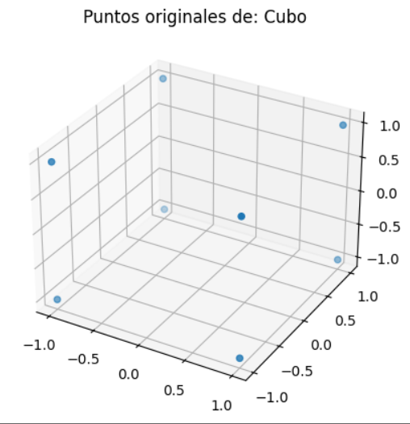

<a id="ortogonal-cubo"></a>
Proyección ortogonal de los vértices del cubo en el plano
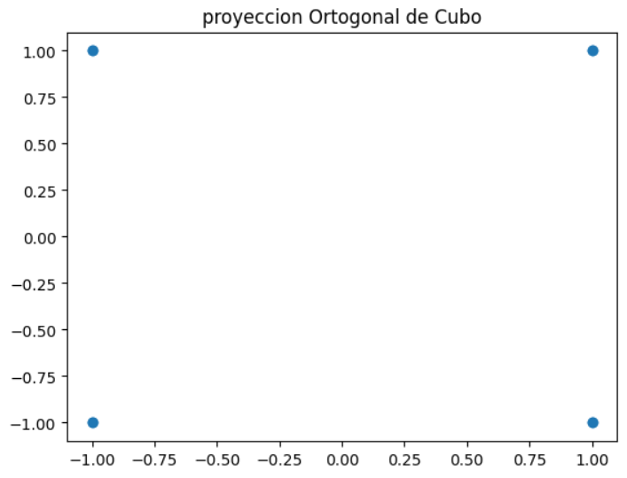

<a id="cubo-d1"></a>
Matriz de proyección aplicada al conjunto de puntos que representan los vétices con distancia focal de 1.
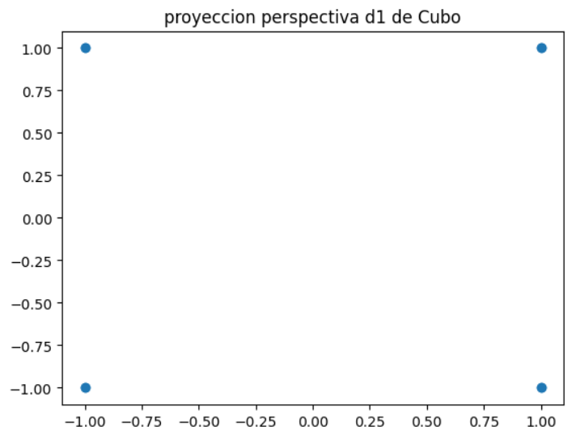

<a id="cubo-d2"></a>
Matriz de proyección aplicada al conjunto de puntos que representan los vétices con distancia focal de 2.
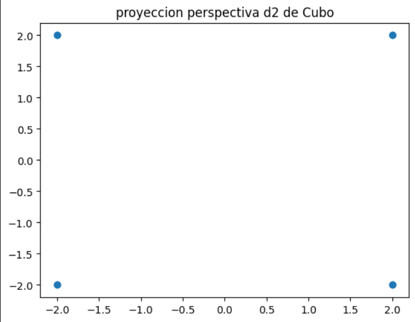

<a id="cubo-d05"></a>
Matriz de proyección aplicada al conjunto de puntos que representan los vétices con distancia focal de 0.5.
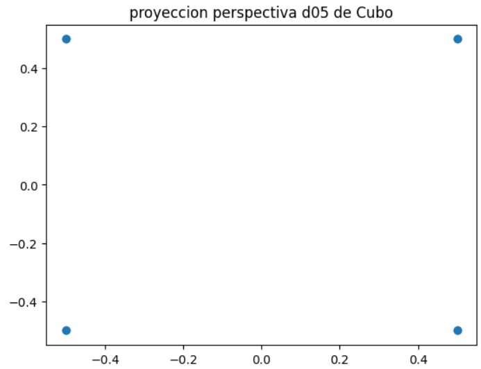

### Three.js - Implementación

<a id="Visualización-perspectiva-horizonte"></a>
Visualización desde una camara en modo perspectiva
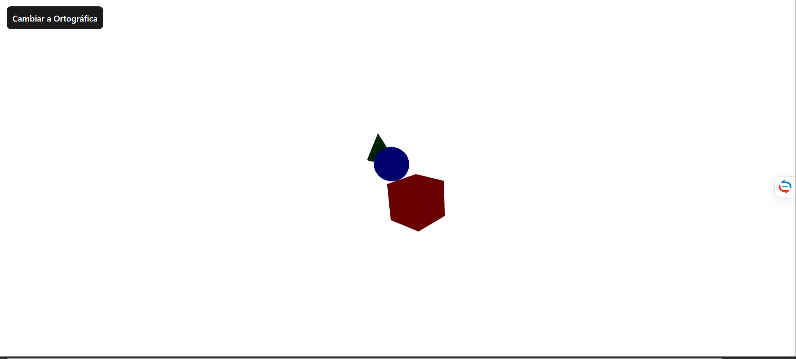
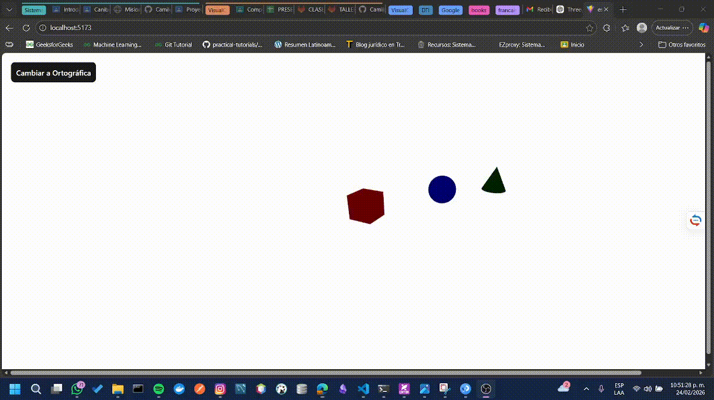

<a id="Visualización-ortogonal-horizonte"></a>
Visualización desde una camara en modo ortográfica
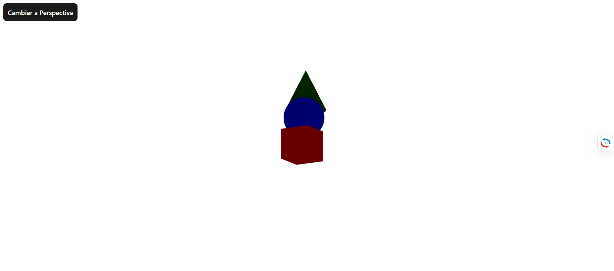
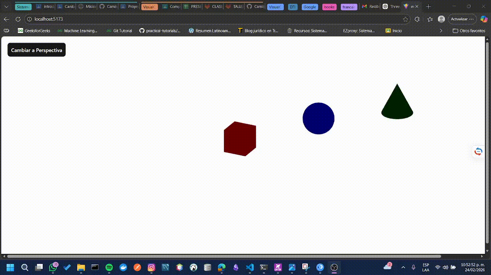

### unity - Implementación
<a id="creacion-cubos"></a>
Creación de cinco cubos alineados en z
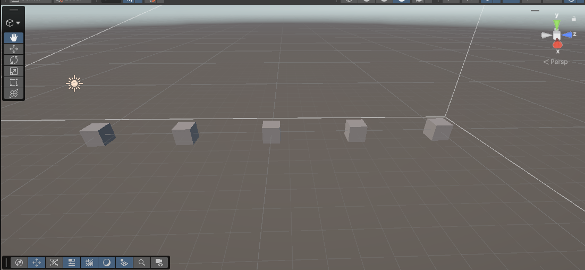
<a id="Visualización-FOV"></a>
**Cámara en modo perspective con diferentes valores de fov**
*fov30*
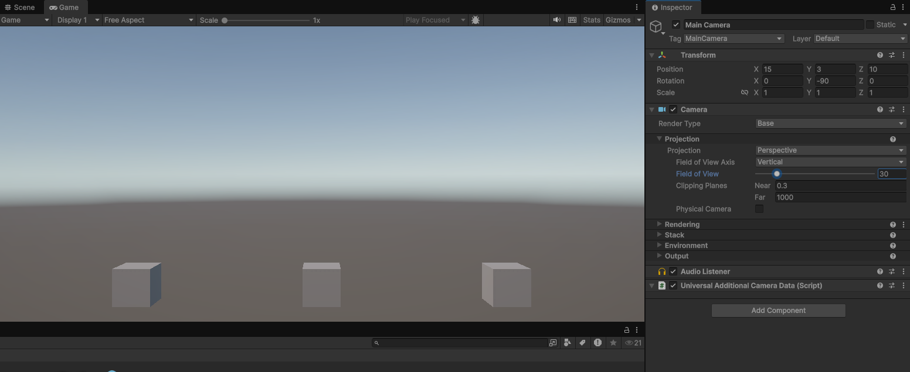
*fov50*
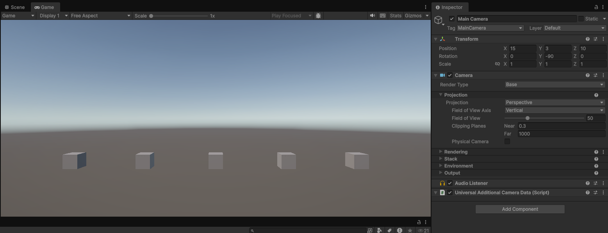
*fov60*
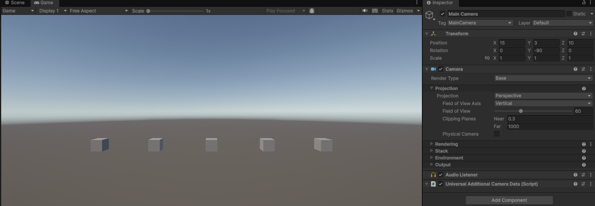
*fov90*
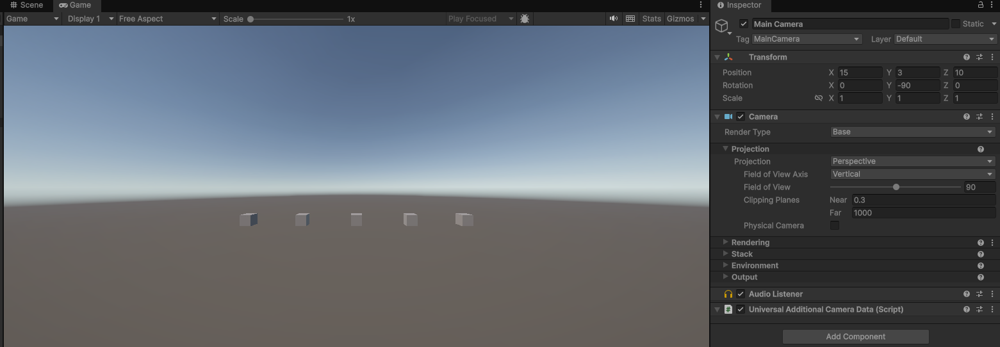
*fov120*
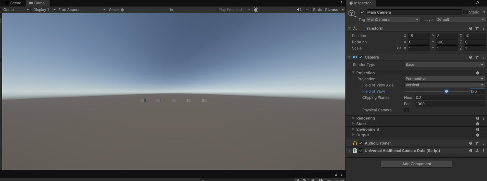
<a id="Visualización-camara-orto-unity"></a>
Cámara en modo ortographic
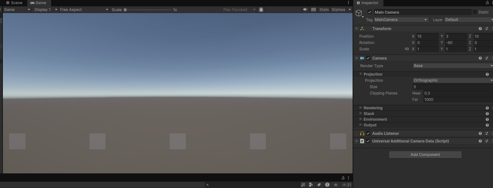

### processing - Implementación
<a id="Visualización-processing"></a>
Camara en formato perspectiva
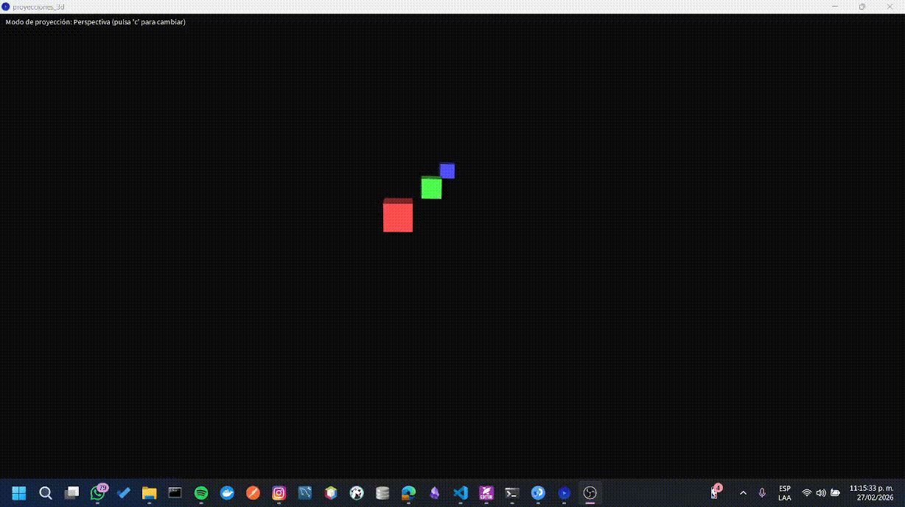
Camara en formato ortogonal
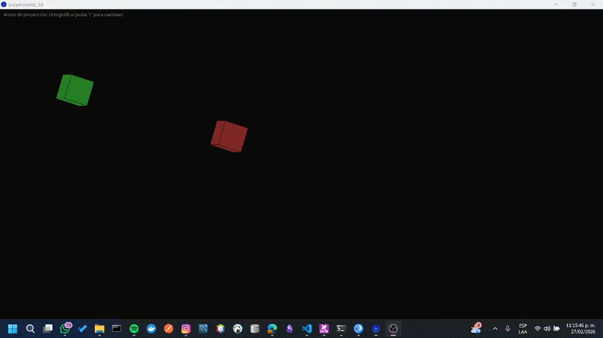


---

## Código relevante


### Ejemplo de código Processing:
<a id="codigo-processing"></a>

```processing
// Variable booleana para alternar entre proyección perspectiva (true) y ortográfica (false)
boolean usePerspective = true;

void setup() {
  // Ventana de 800x600 píxeles con renderizador 3D (P3D)
  size(800, 600, P3D);
  // Activa antialiasing de 8x para bordes más suaves
  smooth(8);
}

void draw() {
  background(10);

  // --- CONFIGURACIÓN DE LA PROYECCIÓN ---
  if (usePerspective) {
    // Parámetros para proyección perspectiva (efecto de profundidad realista)
    float fov = PI / 3.0;           // Campo de visión vertical: 60 grados
    float aspect = (float) width / (float) height; // Relación de ancho/alto
    float zNear = 1;                 // Plano de recorte cercano (no se dibuja nada más cerca)
    float zFar = 5000;               // Plano de recorte lejano (no se dibuja nada más allá)
    perspective(fov, aspect, zNear, zFar);
  } else {
    // Parámetros para proyección ortográfica (sin deformación por distancia)
    float halfW = width / 2.0;       // Mitad del ancho de la ventana
    float halfH = height / 2.0;       // Mitad del alto de la ventana
    float zNear = -5000;              // Plano cercano (puede ser negativo para ver detrás)
    float zFar = 5000;                // Plano lejano
    ortho(-halfW, halfW, -halfH, halfH, zNear, zFar);
  }

  // --- TRANSFORMACIONES GLOBALES DE LA ESCENA ---
  // Traslada el origen de coordenadas al centro de la ventana
  // (por defecto el origen está en la esquina superior izquierda)
  translate(width / 2.0, height / 2.0, 0);

  // Rota lentamente alrededor del eje Y para apreciar la profundidad
  rotateY(frameCount * 0.01);
  // Inclinación fija hacia abajo (para ver mejor los cubos)
  rotateX(-0.3);

  // Activa iluminación básica para que los cubos tengan volumen
  lights();

  // --- DIBUJO DE LOS TRES CUBOS ---
  // Cada cubo se dibuja con una transformación local aislada (push/popMatrix)

  // Cubo cercano (rojo) en posición (-120, 0, -300)
  pushMatrix();
  translate(-120, 0, -300);
  fill(255, 80, 80);   // Color rojo
  box(80);              // Cubo de lado 80
  popMatrix();

  // Cubo intermedio (verde) en posición (0, 0, -800)
  pushMatrix();
  translate(0, 0, -800);
  fill(80, 255, 80);   // Color verde
  box(80);
  popMatrix();

  // Cubo lejano (azul) en posición (120, 0, -1400)
  pushMatrix();
  translate(120, 0, -1400);
  fill(80, 80, 255);   // Color azul
  box(80);
  popMatrix();

  camera();               // Restablece la cámara a la vista 2D por defecto
  hint(DISABLE_DEPTH_TEST);

  fill(255);
  textAlign(LEFT, TOP);
  textSize(16);
  // Muestra el modo actual (Perspectiva u Ortográfica)
  String mode = usePerspective ? "Perspectiva" : "Ortográfica";
  text("Modo de proyección: " + mode + " (pulsa 'c' para cambiar)", 12, 12);

  hint(ENABLE_DEPTH_TEST); // Reactiva la prueba de profundidad para los siguientes dibujos 3D
}

void keyPressed() {
  // Cambio modo de proyección
  if (key == 'c' || key == 'C') {
    usePerspective = !usePerspective;
  }
}

```


### Ejemplo de código three js (JavaScript):
<a id="implementacion-threejs"></a>

``` javascript
import { Canvas } from "@react-three/fiber"
import { OrbitControls, PerspectiveCamera, OrthographicCamera } from "@react-three/drei"
import { useState } from "react"
import './App.css'


function Scene({ isPerspective }) {
  return (
    <>
      {/* Cámaras */}
      {isPerspective ? (
        <PerspectiveCamera
          makeDefault
          position={[5, 5, 10]}
          fov={60}
        />
      ) : (
        <OrthographicCamera
          makeDefault
          position={[5, 5, 10]}
          zoom={50}
        />
      )}

      <OrbitControls />

      {/* Luces */}
      <ambientLight intensity={0.5} />
      <pointLight position={[10, 10, 10]} />

      {/* Objeto cercano */}
      <mesh position={[-3, 0, 0]}>
        <boxGeometry args={[1.5, 1.5, 1.5]} />
        <meshStandardMaterial color="red" />
      </mesh>

      {/* Objeto intermedio */}
      <mesh position={[0, 0, -5]}>
        <sphereGeometry args={[1, 32, 32]} />
        <meshStandardMaterial color="blue" />
      </mesh>

      {/* Objeto lejano */}
      <mesh position={[3, 0, -10]}>
        <coneGeometry args={[1, 2, 32]} />
        <meshStandardMaterial color="green" />
      </mesh>
    </>
  )
}

export default function App() {
  const [isPerspective, setIsPerspective] = useState(true)

  return (
    <>
      <button
        style={{
          position: "absolute",
          top: 20,
          left: 20,
          zIndex: 1,
          padding: "10px"
        }}
        onClick={() => setIsPerspective(!isPerspective)}
      >
        Cambiar a {isPerspective ? "Ortográfica" : "Perspectiva"}
      </button>
      
      <div className="canvas">
        <Canvas>
        <Scene isPerspective={isPerspective} />
      </Canvas>

      </div>
      
    </>
  )
}

```

---
## Prompts utilizados
Lista de los prompts utilizados con herramientas de IA generativa durante el desarrollo del taller.
  

```
Generame un código javascript para un proyecto con vite y three js que permita generar
una esfera, un cubo y una pirámide con base circular, esto se genera dentreo de un Canvas.
Además, debe permitir alternar con un botón entre una cámara que sea de perspectiva
y una proyección ortográfica.
Puedes usar la librería @react-three/drei para integrar fácilmente OrbitControls
import { OrbitControls, PerspectiveCamera, OrthographicCamera } from '@react-three/drei'

```  
---
## Aprendizajes y dificultades

### Aprendizajes

Durante el desarrollo del taller se reforzó el uso de matrices de transformación para comprender como cambian las perspectivas de los objetos 3d. También se afianzó la diferencia conceptual entre una cámara ortográfica y una cámara en perspectiva en entornos gráficos como Python, Three.js y Unity


### Dificultades

En la sección de python se describe el desarrollo matemático de estas matrices, una de las principales dificultades fue trasladar el concepto matemático a los motores gráficos. En Three.js y Unity la cámara ya implementa internamente las matrices de proyección, por lo que fue necesario entender qué parámetros correspondían a cada componente teórica (como FOV o zoom) para poder relacionar correctamente la implementación con el modelo matemático estudiado.

### Mejoras futuras

En futuros proyectos se podría profundizar en la implementación manual completa de la matriz de proyección en un pipeline gráfico propio, incluyendo transformaciones de vista y modelo para comprender mejor el flujo completo de renderizado. También sería útil incorporar visualizaciones interactivas que permitan modificar en tiempo real parámetros como la distancia focal o el plano cercano y lejano para analizar su impacto de forma más dinámica.

---

## Contribuciones grupales (si aplica)

| Integrante | Rol |
|---|---|
| Camilo Andrés Medina Sánchez | Implementación de la escena Unity y configuración de objetos |
| Manuel Santiago Mori Ardila | Desarrollo del script CameraController en Unity |
| Cristian Steven Motta Ojeda | Implementación del visor Three.js y componente CameraController |
| Brayan Alejandro Muñoz Pérez | Diseño del panel de controles y estilos CSS |
| Carlos Arturo Murcia Andrade | Pruebas, capturas de resultados y documentación |
| Maicol Sebastián Olarte Ramírez | Integración general y redacción del README |

---
## Estructura del proyecto

```
semana_01_1_construyendo_mundo_3d/
├── python/
├── threejs/
├── media/
├── unity/
├── processing/
├── README.md
└── .gitignore
```

---
## Referencias


---
## Checklist de entrega

- [x] Carpeta con nombre `semana_01_2_conversion_formatos_3d`
- [x] Código limpio y funcional en carpetas por entorno
- [x] GIFs/imágenes incluidos con nombres descriptivos en carpeta `media/`
- [x] README completo con todas las secciones requeridas
- [x] Mínimo 2 capturas/GIFs por implementación
- [x] Commits descriptivos en inglés
- [x] Repositorio organizado y público

---