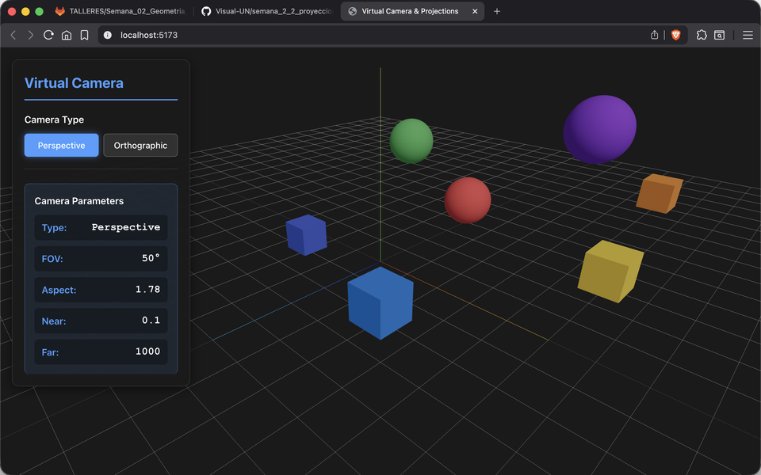
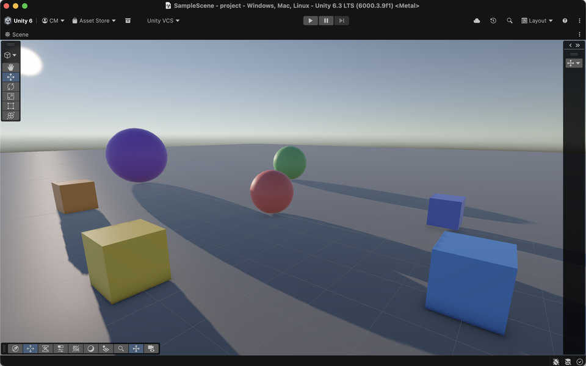
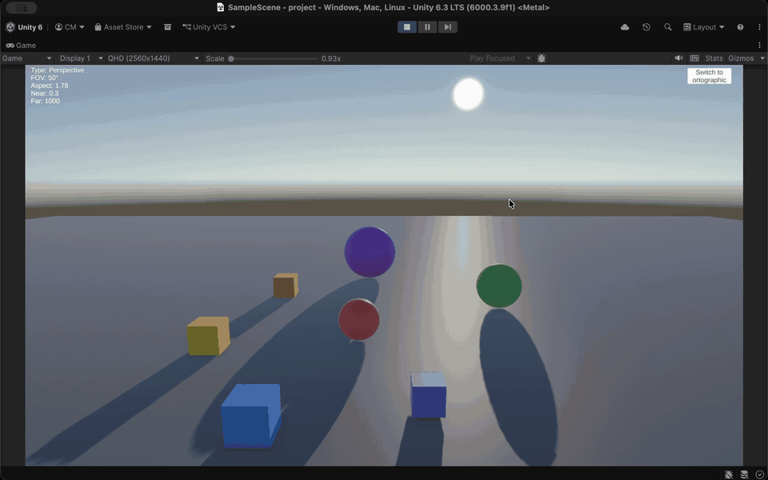

# Proyecciones y Cámara Virtual

## Integrantes

- Camilo Andrés Medina Sánchez 
- Manuel Santiago Mori Ardila
- Cristian Steven Motta Ojeda
- Brayan Alejandro, Muñoz Pérez 
- Carlos Arturo Murcia Andrade
- Maicol Sebastián Olarte Ramírez

## Fecha de entrega

`2026-02-27`

---

## Descripción breve

Taller sobre proyecciones y cámara virtual. Se implementó un visor 3D que permite alternar entre proyección perspectiva y ortográfica, mostrando en tiempo real los parámetros de cada cámara (FOV, aspect, near/far para perspectiva; left, right, top, bottom para ortográfica). Se desarrolló en Three.js con React Three Fiber y en Unity con C#.

---

## Implementaciones

### Three.js / React Three Fiber

Escena 3D con objetos distribuidos a diferentes distancias (cubos y esferas). Panel de control lateral para alternar entre cámara perspectiva y ortográfica. Se muestran los parámetros de la cámara activa en tiempo real. Incluye OrbitControls para navegación y grid/ejes de referencia.

### Unity

Escena con objetos de colores a distintas profundidades. Script `CameraController` que alterna entre proyección perspectiva y ortográfica mediante un botón UI. Incluye un slider para ajustar el tamaño ortográfico y un panel de texto que muestra los parámetros de la cámara activa.

---

## Resultados visuales

### Three.js - Implementación



Panel de control con selector de tipo de cámara y parámetros en tiempo real (FOV, aspect, near, far) sobre la escena 3D con objetos a distintas profundidades.


Alternado dinámico entre proyección perspectiva y ortográfica, mostrando cómo cambian los parámetros y la percepción de profundidad de los objetos.

### Unity - Implementación



Escena en Unity con objetos de colores, botón de cambio de proyección y panel mostrando los parámetros de la cámara perspectiva.



Cambio entre proyección perspectiva y ortográfica con el slider de tamaño ortográfico, mostrando la actualización en tiempo real de los parámetros.

---

## Código relevante

### Three.js - Controlador de cámara:

```javascript
function CameraController({ cameraType, onCameraInfo }) {
  const { camera, set, size } = useThree()
  const perspRef = useRef()
  const orthoRef = useRef()

  useEffect(() => {
    const aspect = size.width / size.height
    perspRef.current = new THREE.PerspectiveCamera(50, aspect, 0.1, 1000)
    perspRef.current.position.set(8, 6, 8)

    const frustum = 8
    orthoRef.current = new THREE.OrthographicCamera(
      -frustum * aspect, frustum * aspect,
      frustum, -frustum, 0.1, 1000
    )
    orthoRef.current.position.set(8, 6, 8)
  }, [])

  useEffect(() => {
    const active = cameraType === 'perspective'
      ? perspRef.current : orthoRef.current
    active.position.copy(camera.position)
    active.quaternion.copy(camera.quaternion)
    active.updateProjectionMatrix()
    set({ camera: active })
  }, [cameraType, size])
}
```

### Unity - Controlador de cámara:

```csharp
void ToggleProjection()
{
    isPerspective = !isPerspective;
    cam.orthographic = !isPerspective;

    if (!isPerspective)
        cam.orthographicSize = orthoSizeSlider.value;

    orthoSizeSlider.gameObject.SetActive(!isPerspective);
    switchButton.GetComponentInChildren<TextMeshProUGUI>().text =
        isPerspective ? "Switch to Orthographic" : "Switch to Perspective";
}

void UpdateInfoText()
{
    if (isPerspective)
        infoText.text = $"Type: Perspective\nFOV: {cam.fieldOfView}°\n" +
                        $"Aspect: {cam.aspect:F2}\nNear: {cam.nearClipPlane}\nFar: {cam.farClipPlane}";
    else
    {
        float size = cam.orthographicSize;
        infoText.text = $"Type: Orthographic\nLeft: {(-size * cam.aspect):F1}\n" +
                        $"Right: {(size * cam.aspect):F1}\nTop: {size:F1}\nBottom: {-size:F1}";
    }
}
```

---

## Prompts utilizados

Se utilizó GitHub Copilot para:
1. Implementar el cambio dinámico entre cámaras perspectiva y ortográfica en Three.js
2. Configurar la UI de Unity para mostrar parámetros de cámara en tiempo real
3. Diseñar la distribución de objetos en la escena a diferentes profundidades

---

## Aprendizajes y dificultades

### Aprendizajes

Se comprendió la diferencia fundamental entre proyección perspectiva (simula visión humana con convergencia) y ortográfica (mantiene tamaños constantes sin importar la distancia). También se aprendió cómo cada tipo de cámara se parametriza de forma distinta y cómo cambiar entre ellas preservando la posición y orientación.

### Dificultades

El principal reto fue mantener la transformación de la cámara al cambiar de tipo de proyección, ya que se debe copiar posición y rotación de la cámara anterior a la nueva. En Unity, la configuración del Canvas UI para el slider y el texto requirió ajustes de layout.

---

## Contribuciones grupales (si aplica)

| Integrante | Rol |
|---|---|
| Camilo Andrés Medina Sánchez | Implementación de la escena Unity y configuración de objetos |
| Manuel Santiago Mori Ardila | Desarrollo del script CameraController en Unity |
| Cristian Steven Motta Ojeda | Implementación del visor Three.js y componente CameraController |
| Brayan Alejandro Muñoz Pérez | Diseño del panel de controles y estilos CSS |
| Carlos Arturo Murcia Andrade | Pruebas, capturas de resultados y documentación |
| Maicol Sebastián Olarte Ramírez | Integración general y redacción del README |

---

## Estructura del proyecto

```
semana_02_2_proyecciones_camara_virtual/
├── threejs/
│   ├── src/
│   │   ├── App.jsx              # Estado y lógica principal
│   │   ├── components/
│   │   │   ├── ModelViewer.jsx  # Escena 3D y controlador de cámara
│   │   │   └── Controls.jsx     # Panel de controles UI
│   ├── public/models/
│   └── package.json
├── unity/
│   └── project/
│       └── Assets/
│           └── CameraController.cs  # Script de control de cámara
├── media/                # Capturas de resultados
└── README.md
```

---

## Referencias

- **React Three Fiber**: https://docs.pmnd.rs/react-three-fiber/ - React renderer para Three.js
- **Three.js Camera**: https://threejs.org/docs/#api/en/cameras/PerspectiveCamera - Documentación de cámaras
- **Drei**: https://github.com/pmndrs/drei - Helpers para R3F
- **Unity Camera**: https://docs.unity3d.com/Manual/class-Camera.html - Documentación de cámara en Unity

---
