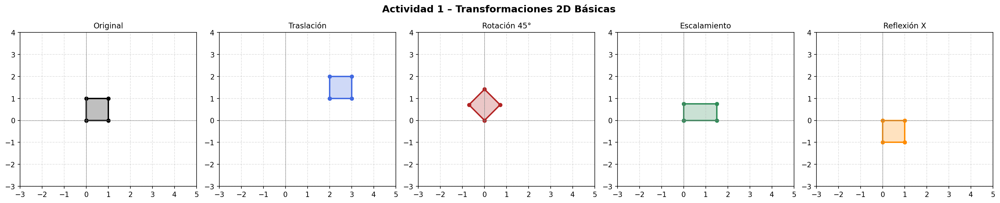
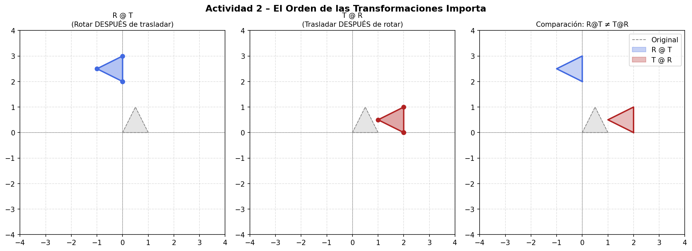
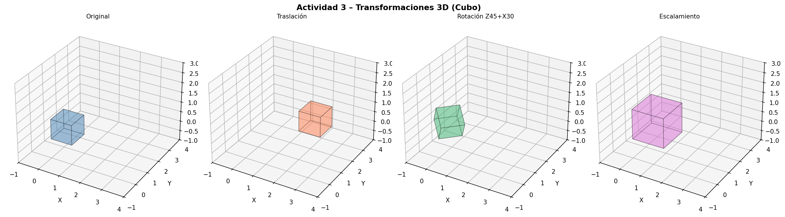
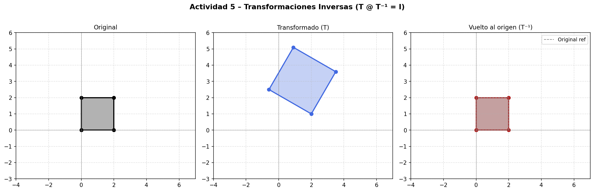
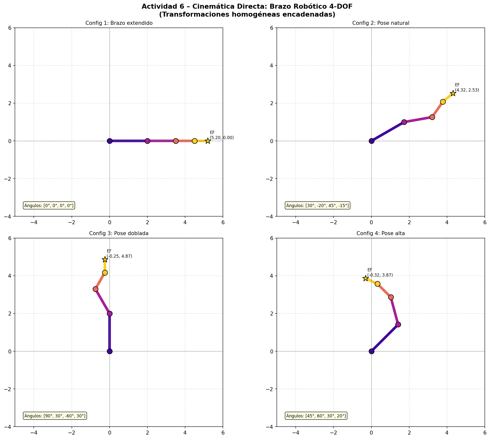
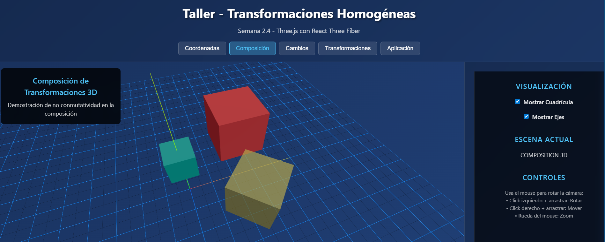
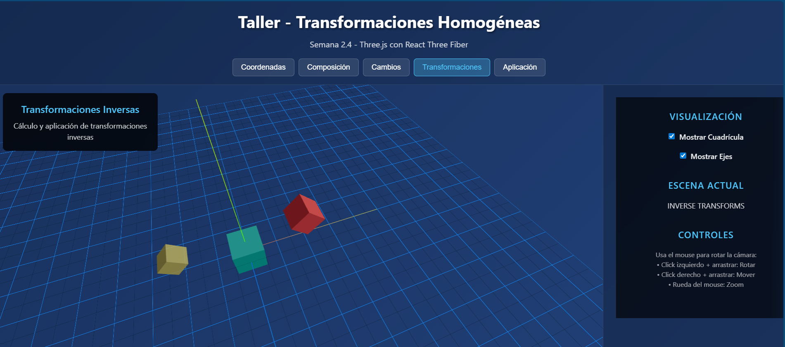

# Taller Transformaciones Homogeneas

**Nombre del estudiante:** 
- Camilo Andrés Medina Sánchez 
- Manuel Santiago Mori Ardila
- Cristian Steven Motta Ojeda
- Brayan Alejandro, Muñoz Pérez 
- Carlos Arturo Murcia Andrade
- Maicol Sebastián Olarte Ramírez
**Fecha de entrega:** 27/02/2026
**Repositorio:** `semana_2_4_transformaciones_homogeneas`

---

## Descripción breve

Este taller aplica transformaciones homogéneas en coordenadas 2D y 3D usando matrices aumentadas (3×3 para 2D y 4×4 para 3D). Se implementaron traslaciones, rotaciones, escalamientos, reflexiones, composición de transformaciones, cambios de base entre sistemas de referencia y la aplicación de cinemática directa en un brazo robótico planar.

Las implementaciones se realizaron en **Python** (NumPy + Matplotlib) y **Three.js** (WebGL interactivo).

---

## Implementaciones

### Python (`python/`)

El archivo `transformaciones_homogeneas.py` implementa las 6 actividades completas del taller:

**Actividad 1 – Coordenadas homogéneas 2D**  
Se representa un cuadrado en coordenadas homogéneas `(x, y, 1)` y se le aplican las cuatro transformaciones básicas: traslación, rotación, escalamiento y reflexión, visualizando cada resultado en una figura comparativa de 5 paneles.

**Actividad 2 – Composición de transformaciones**  
Se demuestra que el producto de matrices no es conmutativo: `R @ T ≠ T @ R`. Se aplica una traslación de 2 unidades seguida de rotación 90°, y se compara el resultado según el orden de multiplicación.

**Actividad 3 – Coordenadas homogéneas 3D**  
Se representa un cubo unitario en coordenadas homogéneas `(x, y, z, 1)` y se aplican matrices 4×4: traslación 3D, rotación combinada (Z×X) y escalamiento uniforme, visualizando los cubos en ejes 3D con `mpl_toolkits.mplot3d`.

**Actividad 4 – Cambios de base**  
Se definen tres marcos de referencia encadenados (Mundo W → Frame A → Frame B). Se calcula `T_WB = T_WA @ T_AB` y se transforma un punto desde el frame B hasta el frame mundo, visualizando los ejes de cada sistema con flechas coloreadas.

**Actividad 5 – Transformaciones inversas**  
Se construye una transformación compuesta (traslación + rotación + escala) y se verifica que `T @ T⁻¹ = I` usando `np.linalg.inv`. Se muestra el objeto original, transformado y restaurado superpuestos.

**Actividad 6 – Brazo robótico (Forward Kinematics)**  
Se modela un brazo planar de 4 articulaciones con longitudes `[2.0, 1.5, 1.0, 0.7]`. Cada junta acumula su transformación: `T = T @ R(θᵢ) @ T(lᵢ, 0)`. Se visualizan 4 configuraciones distintas calculando la posición del efector final en cada caso.

---

### Three.js (`threejs/`)

El archivo `index.html` es una aplicación web interactiva que no requiere servidor. Usa Three.js y muestra la transformación de un cubo 3D al que se aplica la matriz compuesta `T × Rz × Ry × Rx × S`, construida manualmente con `THREE.Matrix4`. La matriz 4×4 resultante se muestra en tiempo real.

---

## Resultados visuales

### Actividad 1 – Transformaciones 2D Básicas


### Actividad 2 – Composición (orden importa)


### Actividad 3 – Cubo 3D Transformado


### Actividad 4 – Cambios de Base


### Actividad 5 – Transformación Inversa


### Actividad 6 – Brazo Robótico 4-DOF


### Three.js – Transformaciones 3D Interactivas - 1


### Three.js – Transformaciones 3D Interactivas - 2


---

## Código relevante

### Matriz de traslación 3D
```python
def translation_3d(tx, ty, tz):
    return np.array([
        [1, 0, 0, tx],
        [0, 1, 0, ty],
        [0, 0, 1, tz],
        [0, 0, 0,  1]
    ], dtype=float)
```

### Composición de transformaciones (el orden importa)
```python
# R @ T: primero trasladar, después rotar el resultado
RT = rotation_2d(90) @ translation_2d(2, 0)
# T @ R: primero rotar, después trasladar
TR = translation_2d(2, 0) @ rotation_2d(90)
# RT ≠ TR  ✓
```

### Cinemática directa (cadena de transformaciones)
```python
T = np.eye(3)
for theta, length in zip(joint_angles, link_lengths):
    T = T @ rotation_2d(theta) @ translation_2d(length, 0)
end_effector = apply_transform_2d(T, [[0, 0]])
```

### Cambio de base entre marcos
```python
T_WA = translation_2d(2, 1) @ rotation_2d(30)  # Frame A en mundo
T_AB = translation_2d(1.5, 0.5) @ rotation_2d(-20)  # Frame B en A
T_WB = T_WA @ T_AB   # Frame B visto desde el mundo
p_W  = apply_transform_2d(T_WB, p_B)  # Punto de B a mundo
```

### Three.js – Matriz compuesta manual
```javascript
const mT  = new THREE.Matrix4().makeTranslation(tx, ty, tz);
const mRz = new THREE.Matrix4().makeRotationZ(rz);
const mRy = new THREE.Matrix4().makeRotationY(ry);
const mRx = new THREE.Matrix4().makeRotationX(rx);
const mS  = new THREE.Matrix4().makeScale(sc, sc, sc);
// T × Rz × Ry × Rx × S
const composite = new THREE.Matrix4()
  .multiply(mT).multiply(mRz).multiply(mRy).multiply(mRx).multiply(mS);
cube.matrix.copy(composite);
cube.matrixAutoUpdate = false;
```

---

## Prompts utilizados

Se utilizó IA generativa (Claude) como asistente de codificación para:

1. **Estructurar el código Python modular** — Prompt: *"Crea funciones reutilizables para matrices de transformación 2D y 3D en NumPy con nombres descriptivos y docstrings"*
2. **Visualización de marcos de referencia** — Prompt: *"Dibuja sistemas de coordenadas 2D con flechas coloreadas usando matplotlib annotate con arrowprops"*
3. **Three.js viewport split** — Prompt: *"Cómo renderizar dos escenas Three.js en un mismo canvas usando setViewport y setScissor"*

Todo el código fue revisado, entendido y adaptado manualmente.

---

## Contribuciones grupales (si aplica)

| Integrante | Rol |
|---|---|
| Camilo Andrés Medina Sánchez | Implementación de la escena Unity y configuración de objetos |
| Manuel Santiago Mori Ardila | Desarrollo del script CameraController en Unity |
| Cristian Steven Motta Ojeda | Implementación del visor Three.js y componente CameraController |
| Brayan Alejandro Muñoz Pérez | Diseño del panel de controles y estilos CSS |
| Carlos Arturo Murcia Andrade | Pruebas, capturas de resultados y documentación |
| Maicol Sebastián Olarte Ramírez | Integración general y redacción del README |
---

## Aprendizajes y dificultades

**Aprendizajes principales:**

- La representación homogénea unifica traslación, rotación y escala en una sola operación matricial, lo que hace posible encadenar transformaciones con simples multiplicaciones de matrices.
- El orden de multiplicación es crítico: `R @ T` aplica la traslación primero (en el frame local), mientras que `T @ R` aplica la rotación primero. Este concepto es fundamental en robótica.
- La inversa de una matriz de transformación no es simplemente la transpuesta (salvo para matrices de rotación pura). Para matrices homogéneas completas se usa `np.linalg.inv`.
- Los cambios de base con `T_WB = T_WA @ T_AB` permiten encadenar marcos de referencia arbitrarios, lo que es la base de la cinemática directa.

**Dificultades encontradas:**

- En Three.js, `matrixAutoUpdate = false` es obligatorio al asignar la matriz manualmente; de lo contrario three.js sobreescribe los valores en cada frame con su propia lógica de transform.
- La distinción entre rotación en frame local vs frame global en 3D requirió experimentación hasta lograr el comportamiento esperado.
- Visualizar múltiples sistemas de coordenadas en matplotlib con flechas orientadas correctamente implicó convertir vectores base a través de la transformación antes de dibujarlos.
